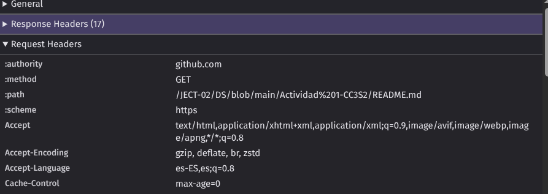
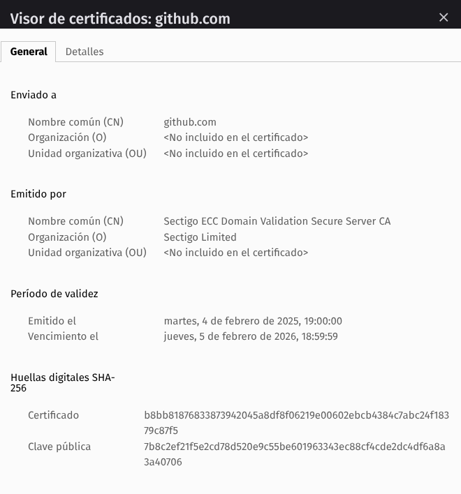
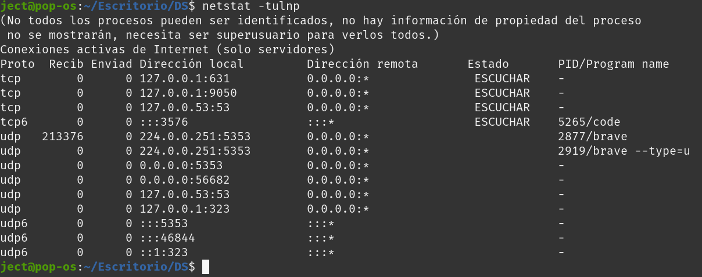
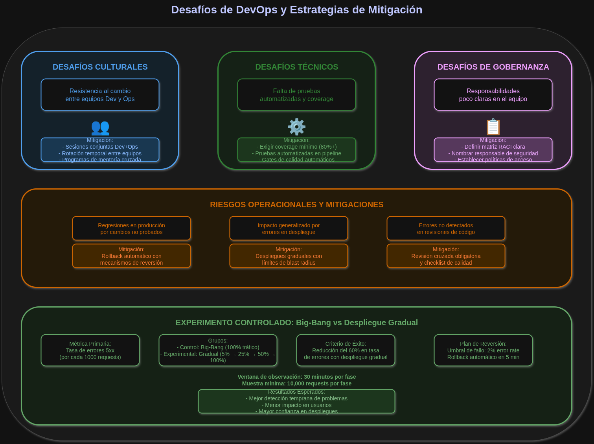

# Actividad 1 – Introducción a DevOps y DevSecOps
**Nombre:** Jhon Edmilson Cruz Tairo
**Fecha:** 27/08/2025  
**Tiempo total invertido (hh:mm):** 00:00  

**Contexto del entorno:** Trabajo en Linux Pop-OS, uso navegador Brave para inspeccionar HTTP/TLS y draw.io para diagramas. No se incluira datos sensibles

## 4.1 DevOps vs Cascada
**Cascada:** Es un enfoque secuencial y lineal para el desarrollo de software, con fases definidas (requisitos, diseño, implementacion, pruebas y despliegue). Es ideal para proyectos con requisitos estables, pero rigidos ante cambios, lo que puede elevar los costos y retrasos `Pressman 2004`

**DevOps:** DevOps en cambio , es una cultura de desarrollo `DEV` y operaciones `OPS`, promoviendo integraciones continuas conocido como (CI/CD), automatizacion y entregas rápidas. Se fomenta la colaboración, retroalimentacion y mejora iterativa, acelerando el time to market `Kim et al 2006`

| Comparativa | Cascada | DevOps |
|------|------|------|
| Estructura   | Lineal, por fases   | Ciclica y colaborativa  |
| Flexibilidad   | Baja, resiste cambios   | Alta, se adapta a cambios   |
| Velocidad   | Lenta en entornos dinamicos (actualidad)   | Rápida e iterativa   |

**IMAGEN COMPARATIVA:**

## 4.2 Ciclo tradicional y silos
### Limitaciones del ciclo "Construccion -> Operación"

Sin integracion continua, el ciclo tradicional se presenta de la siguiente manera:
1. **Grandes Lotes:** Entregas masivas de codigo elevan el **costo de integración tardia**, acumulando conflictos y defectos `Kim et al 2016`
2. **Colas de Defectos:** Los Handoffs sin retroalimentación generan asimetrias de información, restando la resolución y aumento de **MTTR**

### ANTI-PATRONES
1. **Throw Over The Wall:** Desarrolladores entregan software sin colaboración, causan retrabajos y degradaciones repetitivas por la falta de contexto.
2. **Seguridad Tardia:** Auditorias de seguridad al final del ciclo introducen volnurabilidades y retrasos que requieren correcciones costodsas.

  

## 4.3 Principios y Beneficios (CI/CD y Agile)
### CI/CD: Principios Clave
- **Integración Continua (CI)** implica cambios pequeños y frecuentes al codigo, integrados automaticamente con pruebas cercanas al desarrollo `Pressman 2014` **Despliegue Continuo (CD)** automatizado la entrega a entornos de prueba a producción lo que asegura despliegues rápidosy confiables, ambos promueven colaboración DevOps reduciendo asimetrias de informacion mediante retroalimentaciónconstante y automatización `Kim et al 2016`

### Agile como Precursor
- Practicas Agile, como **Reuniones Diarias** y **Retrospectiva**, alimentan el pipeline CI/CD. Las diarias identifican con antelación cuellos de botella, priorizando que cambios promover o bloquear. Las retrospectivas analizan fallos, ajustando pruebas automatizadas para prevenir defectos recurrentes, fortaleciendo la calidad de nuestro despliegue

### Indicador de Colaboración
* **Indicador propuesto:** Tiempo desde el pull request listo hasta despliegues de prueba. Mide la fluidez entre Dev y Ops reflejando colaboración efectiva. Un tiempo reducido indica menos fricciones y mejor alineación.
* **Recolección sin herramientas pagas:**
* **Bitácoras:** Usar logs de sistema de control de versiones (Git) para registrar timestamps de PRs creados y aprobados
* **Metadatos dePRs:** Extraer fechas de aprobación y merge desde plataformas como GitHub (API pública gratuita)
* **Registro de despliegue:** Analizar logs de servidores (jenkings, scripts bash) para marcar el momento de despliegue en pruebas

## 4.4 DevSecOps - SAST vs DAST y gate mínimo
### SAST vs DAST en el Pipeline
**SAST**(Static Application Security Testing) analiza el codigo fuente estaticamente, detectando vulnerabilidades tempranas en la fase de desarrollo (antes de hacer commit) `OWASP 2021`. **DAST** (Dynamic Application Security Testing) prueba la aplicación en ejecución, identificando fallos en entornos de prueba o producción `Kim et al 2016`\
En el Pipeline, **SAST** se integra en la fase de codificación (CI), mientras que **DAST** se ejecuta en despliegues de prueba (CD)
### GATE MINIMO DE SEGURIDAD
1. **Umbral 1:** Cualquier hallazgo critico en componentes expuestos como Api o frontend bloquea la promoción a producción
2. **Umbral 2:** Cobertura minima de pruebas de seguridad del 85% en SAST/DAST
#### Politica de excepción:
* **Condición:** Hallazgos no criticos pueden exceptuar con aprobación del equipo de seguridad
* **Responsable:** Lider de seguirdad asignado
* **Caducidad:** 30 dias máximo
* **Plan de recolección:** Documentar solución en ticket con fecha limite

### Evitar el "Teatro de Seguridad"
El "Teatro de Seguridad" ocurre al cumplir checklists sin reducir riesgos reales, para evitarlo:
1. **Señal 1: Disminución de hallazgos repetidos**
* Comparar reportes SAST/DAST mensuales (logs de herramientas como SOnarQube o OWASP ZAP) para  rastrear recurrencias.
2. **Señal 2: Reducción en tiempo de remedación**
* Calcular el tiempo desde detección como bitacora de herramientas hasta la corrección con un merge en git, usando metadatos de PRs

**Señales de eficacia (no "teatro"):**
1. % de vulnerabilidades recurrentes ≤ **5%** entre dos escaneos consecutivos.  
2. Tiempo de remediación de vulnerabilidades críticas ≤ **48 horas**.

## 4.5 CI/CD y estrategia de despliegue — Canary

**Estrategia elegida:** *Canary deployment* — desplegar primero a un pequeño porcentaje de usuarios y ampliar si no hay problemas. Es adecuada para servicios críticos (ej. autenticación) porque limita el impacto.

**Tabla: riesgos vs mitigaciones**

| Riesgo                         | Mitigación principal                                         |
|-------------------------------:|--------------------------------------------------------------|
| Regresión funcional            | Validación de contrato API antes de promover                 |
| Costo operativo de doble versión | Limitar convivencia a **máx. 24 horas**; plan de cleanup     |
| Manejo de sesiones/estado      | "Draining" de instancias y compatibilidad de esquemas        |

**KPI técnico para promover/abortar**
- **KPI primario:** Tasa de errores HTTP **5xx ≤ 0.1%**.  
- **Ventana de observación:** **1 hora** desde el inicio del canary.  
- **Otros límites:** Latencia **p95 ≤ 300 ms**; CPU/mem ≤ **70%**.  
- **Acción:** Si algún KPI supera su umbral en la ventana, **rollback inmediato** del canary.

**Métricas de producto (coexistencia):**
- Mantener tasa de conversión ≥ **95%** respecto al baseline en **24 horas**. Si cae por debajo, investigar antes de ampliar.

## 4.6 FUNDAMENTOS PRACTICOS 
### 1. **HTTP - contrato observable y TTL**
### Conclusión

El uso del método `GET` y el código `200 OK` confirma que el recurso fue solicitado y entregado correctamente
Las cabeceras muestran que:  
- `cache-control: max-age=0` obliga a revalidar en cada petición, lo que garantiza información fresca pero puede impactar en el rendimiento
- `accept-encoding` habilita compresión en la respuesta, optimizando la velocidad de transferencia y uso de red

En conjunto, estas cabeceras reflejan un balance entre **consistencia del contenido** y **eficiencia en la entrega**
### 2. **TLS - certificado**
- **CN/SAN:** github.com  
- **Vigencia:** desde 4 de febrero de 2025 hasta 5 de febrero de 2026  
- **Emisora:** Sectigo ECC Domain Validation Secure Server CA (Sectigo Limited)  
\
si el certificado no valida la cadena se producen errores de confianza en el navegador  
esto expone al usuario a riesgo de ataques man in the middle (MITM)  
tambien afecta la experiencia de usuario ya que los navegadores muestran advertencias de sitio inseguro y pueden bloquear el acceso
### 3. **Puertos - estado runtime**
- **Puerto 631 (tcp, localhost):** servicio de impresión (CUPS)  
- **Puerto 9050 (tcp, localhost):** servicio de proxy/Tor  
\
la evidencia de puertos muestra que hay servicios activos en la máquina  
si un servicio esperado no aparece en escucha significa que el despliegue no se completó correctamente  
si un puerto ya está ocupado por otro proceso puede causar conflictos al intentar iniciar un nuevo servicio en ese mismo puerto
### 4. **12-FACTOR resumen practico**
- **Port binding:** la aplicación debe recibir el puerto desde una **variable de entorno** (p.ej. PORT) para que el mismo programa corra en cualquier entorno sin cambios
- **Configuración:** separar configuración (credenciales, endpoints) en variables de entorno, no en el código
- **Logs:** imprimir logs a la salida estándar (stdout) para que el sistema de ejecución los capture; no escribir logs en archivos locales manualmente
**Anti-patrón:** guardar contraseñas en el código; esto rompe la reproducibilidad y es riesgo de seguridad

### 5. **Diagnóstico de problemas intermitentes**

* **Revisar contrato HTTP:**
Confirma que el endpoint responde correctamente con código 200
Verifica las cabeceras Cache-Control y X-Request-ID
Si encuentras errores 5xx, revierte al despliegue anterior y crea un ticket

* **Verificar resolución DNS:**
Comprueba que el dominio apunta a la IP correcta
Revisa los registros A/CNAME y su TTL correspondiente
Si la IP es incorrecta, contacta al proveedor DNS y aplica rollback

* **Comprobar certificado TLS:**
Valida que el certificado es válido y no está expirado
Confirma que el CN/SAN coincide con lo esperado
Si está expirado, renueva el certificado y reinicia el servicio

* **Confirmar puertos en escucha:**
Verifica que el servicio está escuchando en el puerto correcto (ej: 443)
Si el puerto no está abierto, revisa los logs y reinicia el contenedor

* **Revisar recursos del host:**
Monitoriza el consumo de CPU y memoria
Si hay saturación, aumenta recursos o reinicia instancias de forma controlada

* **Validar despliegues recientes:**
Correlaciona los horarios de problemas con los últimos despliegues
Si coincide, realiza rollback y programa una revisión post-mortem

### 6. **Desafios y mitigaciones**
- Cultural: resistencia al cambio. Mitigación: hacer sesiones conjuntas Dev+Ops y rotación temporal  
- Técnico: falta de pruebas automatizadas. Mitigación: exigir coverage mínimo y pruebas en pipeline  
- Gobernanza: responsabilidades poco claras. Mitigación: definir RACI y nombrar un responsable de seguridad

### 7. Arquitectura mínima

#### Flujo Principal de Arquitectura
- **Cliente:** Navegador o aplicación con controles de validación TLS y políticas de caché  
- **DNS:** Sistema de resolución de nombres con controles de TTL, DNSSEC y rate limiting  
- **Servicio HTTP:** API/Web con validación de contratos API y headers de seguridad  
- **TLS/SSL:** Capa de cifrado con controles de certificados y cipher suites modernas  
- **Backend Services:** Aplicación con controles de rate limiting y validación de entrada  

#### Principios 12-Factor con Evidencias

**Configuración por entorno:**  
- Evidencias: Diffs mínimos entre entornos, configuración externalizada, secrets en vaults seguros  
- Contribuye a despliegues reproducibles al eliminar diferencias entre entornos  

**Logs como flujos de eventos:**  
- Evidencias: Trazabilidad completa, agregación centralizada, correlación de requests  
- Permite monitorización en tiempo real y debugging eficiente  

#### Beneficios de la Arquitectura
- **Seguridad por capas:** Controles específicos en cada nivel (DNS, HTTP, TLS, Backend)  
- **Despliegues reproducibles:** Configuración consistente entre entornos  
- **Monitorización completa:** Trazabilidad de logs y métricas operativas  
- **Cumplimiento de estándares:** Implementación de principios 12-Factor y mejores prácticas DevSecOps  

### 8. Tabla de evidencias
### Tabla de evidencias

| Evidencia               | Descripción                                                        |
|--------------------------|--------------------------------------------------------------------|
| `http-evidencia.png`    | Método GET, código 200 y cabeceras (Cache-Control, Accept-Encoding) |
| `tls-cert.png`          | Certificado CN/SAN, vigencia y emisor                              |
| `puertos.png`           | Puertos en escucha en el host (631 y 9050)                         |
| `desafios_devops.png`   | Desafíos (cultural, técnico, gobernanza) y sus mitigaciones        |
| `arquitectura_minima.png` | Diagrama de arquitectura mínima con controles y principios 12-Factor |
| `devops-vs-cascada.png` | Comparativa visual entre modelo en cascada y DevOps                |
| `silos-equipos.png`     | Representación de silos y anti-patrones en ciclo tradicional        |
| `pipeline_canary.png`   | Pipeline de despliegue canario con KPIs                            |

