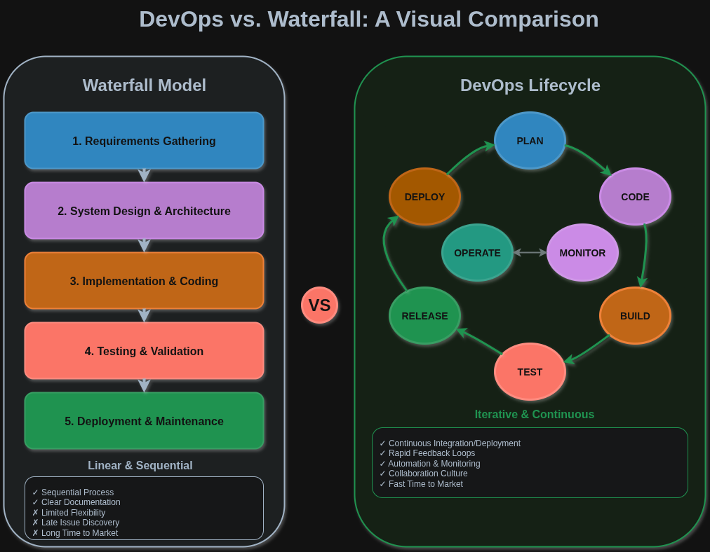
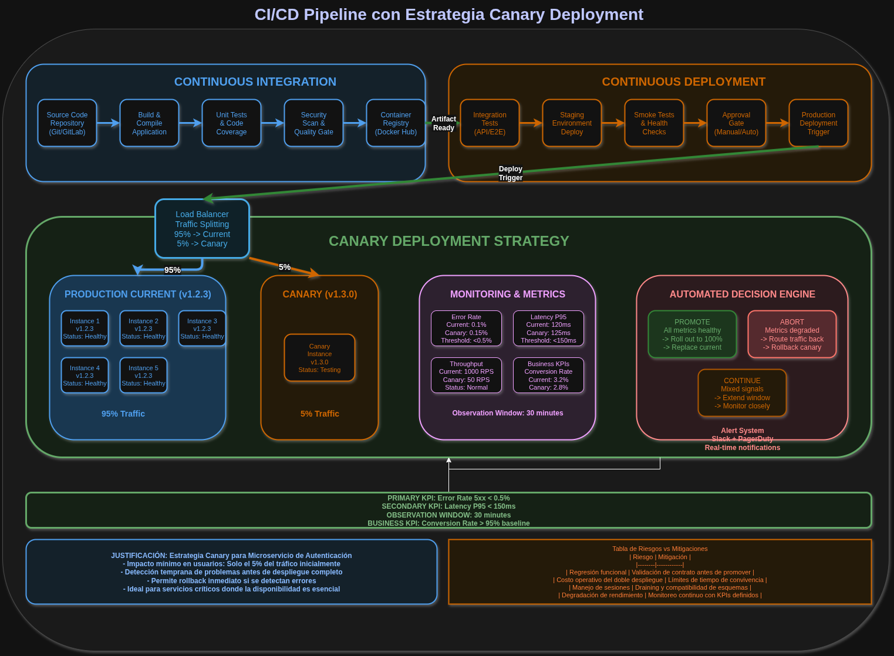

# Actividad 1 – Introducción a DevOps y DevSecOps
**Nombre:** Jhon Edmilson Cruz Tairo
**Fecha:** 27/08/2025  
**Tiempo total invertido (hh:mm):** 00:00  

**Contexto del entorno:** Trabajo en Linux Pop-OS, uso navegador Brave para inspeccionar HTTP/TLS y draw.io para diagramas. No se incluira datos sensibles

## 4.1 DevOps vs Cascada
**Cascada:** Es un enfoque secuencial y lineal para el desarrollo de software, con fases definidas (requisitos, diseño, implementacion, pruebas y despliegue). Es ideal para proyectos con requisitos estables, pero rigidos ante cambios, lo que puede elevar los costos y retrasos `Pressman 2004`

**DevOps:** DevOps en cambio , es una cultura de desarrollo `DEV` y operaciones `OPS`, promoviendo integraciones continuas conocido como (CI/CD), automatizacion y entregas rápidas. Se fomenta la colaboración, retroalimentacion y mejora iterativa, acelerando el time to market `Kim et al 2006`

| Comparativa | Cascada | DevOps |
|------|------|------|
| Estructura   | Lineal, por fases   | Ciclica y colaborativa  |
| Flexibilidad   | Baja, resiste cambios   | Alta, se adapta a cambios   |
| Velocidad   | Lenta en entornos dinamicos (actualidad)   | Rápida e iterativa   |

**IMAGEN COMPARATIVA:**

## 4.2 Ciclo tradicional y silos
### Limitaciones del ciclo "Construccion -> Operación"

Sin integracion continua, el ciclo tradicional se presenta de la siguiente manera:
1. **Grandes Lotes:** Entregas masivas de codigo elevan el **costo de integración tardia**, acumulando conflictos y defectos `Kim et al 2016`
2. **Colas de Defectos:** Los Handoffs sin retroalimentación generan asimetrias de información, restando la resolución y aumento de **MTTR**

### ANTI-PATRONES
1. **Throw Over The Wall:** Desarrolladores entregan software sin colaboración, causan retrabajos y degradaciones repetitivas por la falta de contexto.
2. **Seguridad Tardia:** Auditorias de seguridad al final del ciclo introducen volnurabilidades y retrasos que requieren correcciones costodsas.

  

## 4.3 Principios y Beneficios (CI/CD y Agile)
### CI/CD: Principios Clave
- **Integración Continua (CI)** implica cambios pequeños y frecuentes al codigo, integrados automaticamente con pruebas cercanas al desarrollo `Pressman 2014` **Despliegue Continuo (CD)** automatizado la entrega a entornos de prueba a producción lo que asegura despliegues rápidosy confiables, ambos promueven colaboración DevOps reduciendo asimetrias de informacion mediante retroalimentaciónconstante y automatización `Kim et al 2016`

### Agile como Precursor
- Practicas Agile, como **Reuniones Diarias** y **Retrospectiva**, alimentan el pipeline CI/CD. Las diarias identifican con antelación cuellos de botella, priorizando que cambios promover o bloquear. Las retrospectivas analizan fallos, ajustando pruebas automatizadas para prevenir defectos recurrentes, fortaleciendo la calidad de nuestro despliegue

### Indicador de Colaboración
* **Indicador propuesto:** Tiempo desde el pull request listo hasta despliegues de prueba. Mide la fluidez entre Dev y Ops reflejando colaboración efectiva. Un tiempo reducido indica menos fricciones y mejor alineación.
* **Recolección sin herramientas pagas:**
* **Bitácoras:** Usar logs de sistema de control de versiones (Git) para registrar timestamps de PRs creados y aprobados
* **Metadatos dePRs:** Extraer fechas de aprobación y merge desde plataformas como GitHub (API pública gratuita)
* **Registro de despliegue:** Analizar logs de servidores (jenkings, scripts bash) para marcar el momento de despliegue en pruebas

## 4.4 DevSecOps - SAST vs DAST y gate mínimo
### SAST vs DAST en el Pipeline
**SAST**(Static Application Security Testing) analiza el codigo fuente estaticamente, detectando vulnerabilidades tempranas en la fase de desarrollo (antes de hacer commit) `OWASP 2021`. **DAST** (Dynamic Application Security Testing) prueba la aplicación en ejecución, identificando fallos en entornos de prueba o producción `Kim et al 2016`\
En el Pipeline, **SAST** se integra en la fase de codificación (CI), mientras que **DAST** se ejecuta en despliegues de prueba (CD)
### GATE MINIMO DE SEGURIDAD
1. **Umbral 1:** Cualquier hallazgo critico en componentes expuestos como Api o frontend bloquea la promoción a producción
2. **Umbral 2:** Cobertura minima de pruebas de seguridad del 85% en SAST/DAST
#### Politica de excepción:
* **Condición:** Hallazgos no criticos pueden exceptuar con aprobación del equipo de seguridad
* **Responsable:** Lider de seguirdad asignado
* **Caducidad:** 30 dias máximo
* **Plan de recolección:** Documentar solución en ticket con fecha limite

### Evitar el "Teatro de Seguridad"
El "Teatro de Seguridad" ocurre al cumplir checklists sin reducir riesgos reales, para evitarlo:
1. **Señal 1: Disminución de hallazgos repetidos**
* Comparar reportes SAST/DAST mensuales (logs de herramientas como SOnarQube o OWASP ZAP) para  rastrear recurrencias.
2. **Señal 2: Reducción en tiempo de remedación**
* Calcular el tiempo desde detección como bitacora de herramientas hasta la corrección con un merge en git, usando metadatos de PRs

**Señales de eficacia (no "teatro"):**
1. % de vulnerabilidades recurrentes ≤ **5%** entre dos escaneos consecutivos.  
2. Tiempo de remediación de vulnerabilidades críticas ≤ **48 horas**.

## 4.5 CI/CD y estrategia de despliegue — Canary

**Estrategia elegida:** *Canary deployment* — desplegar primero a un pequeño porcentaje de usuarios y ampliar si no hay problemas. Es adecuada para servicios críticos (ej. autenticación) porque limita el impacto.

**Tabla: riesgos vs mitigaciones**

| Riesgo                         | Mitigación principal                                         |
|-------------------------------:|--------------------------------------------------------------|
| Regresión funcional            | Validación de contrato API antes de promover                 |
| Costo operativo de doble versión | Limitar convivencia a **máx. 24 horas**; plan de cleanup     |
| Manejo de sesiones/estado      | "Draining" de instancias y compatibilidad de esquemas        |

**KPI técnico para promover/abortar**
- **KPI primario:** Tasa de errores HTTP **5xx ≤ 0.1%**.  
- **Ventana de observación:** **1 hora** desde el inicio del canary.  
- **Otros límites:** Latencia **p95 ≤ 300 ms**; CPU/mem ≤ **70%**.  
- **Acción:** Si algún KPI supera su umbral en la ventana, **rollback inmediato** del canary.

**Métricas de producto (coexistencia):**
- Mantener tasa de conversión ≥ **95%** respecto al baseline en **24 horas**. Si cae por debajo, investigar antes de ampliar.

