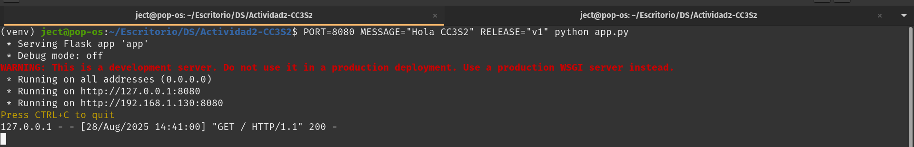
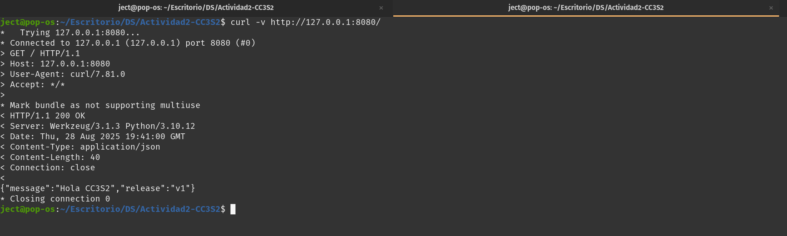
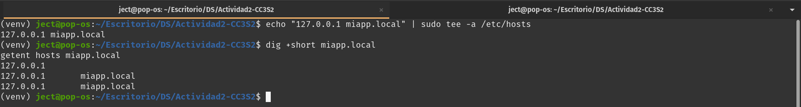
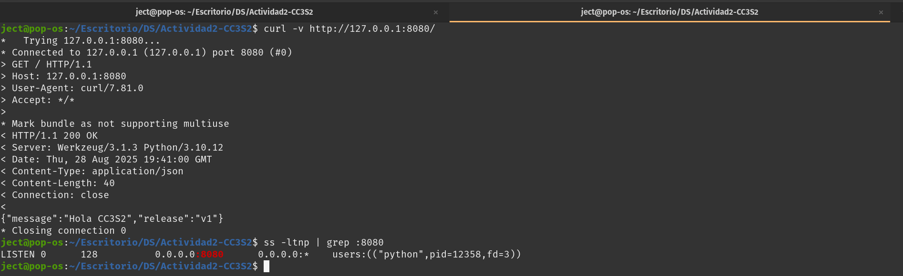
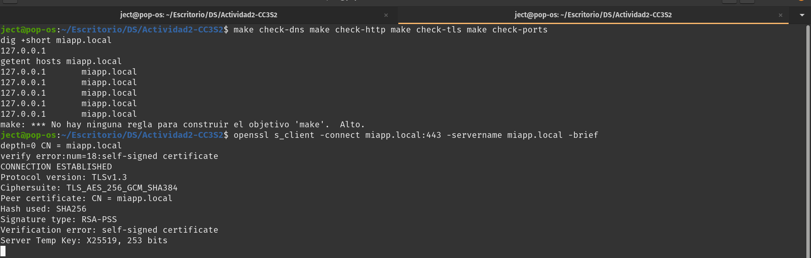

# Reporte Actividad 2

## Evidencias de Ejecución

### 1. Aplicación Flask ejecutándose


### 2. Prueba HTTP directa



### 3. Verificación DNS


### 4. Puertos en uso


### 5. Verifiación general


# Respuestas Preguntas Guía - Actividad 2

## 1. HTTP: Idempotencia de métodos y su impacto en retries/health checks

**Idempotencia** significa que ejecutar la misma operacion multiples veces produce el mismo resultado

**Metodos idempotentes:**
- `GET`: solo consulta, no modifica
- `PUT`: reemplaza completamente, mismo resultado final
- `DELETE`: elimina una vez, ya eliminado = mismo efecto

**Metodos NO idempotentes:**
- `POST`: cada ejecucion puede crear recursos nuevos

```bash

**Idempotencia** significa que ejecutar la misma operacion multiples veces produce el mismo resultado

**Metodos idempotentes:**
- `GET`: solo consulta, no modifica
- `PUT`: reemplaza completamente, mismo resultado final
- `DELETE`: elimina una vez, ya eliminado = mismo efecto

**Metodos NO idempotentes:**
- `POST`: cada ejecucion puede crear recursos nuevos

```bash
curl -X PUT http://api.com/user/123 -d '{"name":"Juan"}'

curl -X POST http://api.com/users -d '{"name":"Juan"}'
```

**Impacto:** health checks usan `GET` (seguro repetir), sistemas retry automatico solo reintetan `GET/PUT/DELETE`, nunca `POST`

## 2. DNS: /etc/hosts vs DNS autoritativo, utilidad en laboratorio

**/etc/hosts:**
- Archivo local, consulta antes que DNS
- Solo afecta la maquina local
- No tiene TTL, resolucion instantanea

**DNS autoritativo:**
- Servidor central, distribuido globalmente  
- Afecta a todos los clientes que consultan esa zona
- Maneja TTL para control de cache

```bash
echo "127.0.0.1 miapp.local" >> /etc/hosts

dig @8.8.8.8 example.com A +ttlunits
```

**Por que hosts sirve para laboratorio:** permite simular dominios sin configurar DNS real, facil setup/teardown, no requiere infraestructura externa

**TTL y cache:** TTL alto = menos consultas DNS pero actualizaciones lentas, TTL bajo = mas consultas pero cambios rapidos

## 3. TLS: Rol de SNI en handshake

**SNI (Server Name Indication)** permite que un servidor con una IP maneje multiples certificados para diferentes dominios

**En el handshake:**
1. Cliente envia nombre del host en extension SNI
2. Servidor selecciona certificado correcto basado en SNI
3. Continua handshake con cert apropiado

```bash
openssl s_client -connect miapp.local:443 -servername miapp.local -brief
# Sin SNI podria devolver cert incorrecto o error
```

**Importancia:** sin SNI, servidores solo pueden usar un cert por IP, limitando hosting compartido HTTPS

## 4. 12-Factor: Logs a stdout y config por entorno

**Logs a stdout:**
- App no maneja rotacion/almacenamiento de logs
- Sistema externo (systemd, Docker, k8s) captura y enruta
- Facilita agregacion centralizada y monitoring

**Config por entorno:**
- Variables de entorno permiten misma imagen/codigo en dev/staging/prod
- No secrets hardcodeados en codigo fuente
- CI/CD puede inyectar config segun ambiente

```bash
PORT=8080 MESSAGE="Dev" python app.py
PORT=8080 MESSAGE="Prod" python app.py
```

**Ventajas contenedores:** Docker captura stdout automaticamente, variables ENV faciles de pasar, misma imagen funciona en cualquier ambiente

## 5. Operación: ss vs curl, triangulacion con logs

**ss -ltnp muestra:**
- Puertos en escucha a nivel de SO
- Proceso que maneja cada socket
- Estado real de red layer

**curl muestra:**
- Respuesta de aplicacion layer
- Conectividad end-to-end
- Headers HTTP y contenido

```bash
ss -ltnp | grep :8080  # Proceso escuchando
curl -v http://localhost:8080/  # app respondd correctamente?
```

**Triangulacion problemas:**
1. `ss` confirma que puerto está abierto
2. `curl` verifica conectividad HTTP  
3. `journalctl -u nginx` muestra errores de proxy
4. `tail -f /var/log/nginx/access.log` muestra requests llegando

**Flujo diagnostico:** puerto cerrado → `ss`, timeout → routing/firewall, 502 error → logs nginx, 500 error → logs aplicacionnte - 5 veces = mismo resultado
curl -X PUT http://api.com/user/123 -d '{"name":"Juan"}'

# POST no idempotente - 5 veces = 5 usuarios creados
curl -X POST http://api.com/users -d '{"name":"Juan"}'
```

**Impacto:** health checks usan `GET` (seguro repetir), sistemas retry automatico solo reintetan `GET/PUT/DELETE`, nunca `POST`

## 2. DNS: /etc/hosts vs DNS autoritativo, utilidad en laboratorio

**/etc/hosts:**
- Archivo local, consulta antes que DNS
- Solo afecta la maquina local
- No tiene TTL, resolucion instantanea

**DNS autoritativo:**
- Servidor central, distribuido globalmente  
- Afecta a todos los clientes que consultan esa zona
- Maneja TTL para control de cache

```bash
# hosts local para laboratorio
echo "127.0.0.1 miapp.local" >> /etc/hosts

# DNS real seria
dig @8.8.8.8 example.com A +ttlunits
```

**Por que hosts sirve para laboratorio:** permite simular dominios sin configurar DNS real, facil setup/teardown, no requiere infraestructura externa

**TTL y cache:** TTL alto = menos consultas DNS pero actualizaciones lentas, TTL bajo = mas consultas pero cambios rapidos

## 3. TLS: Rol de SNI en handshake

**SNI (Server Name Indication)** permite que un servidor con una IP maneje multiples certificados para diferentes dominios

**En el handshake:**
1. Cliente envia nombre del host en extension SNI
2. Servidor selecciona certificado correcto basado en SNI
3. Continua handshake con cert apropiado

```bash
openssl s_client -connect miapp.local:443 -servername miapp.local -brief
```

**Importancia:** sin SNI, servidores solo pueden usar un cert por IP, limitando hosting compartido HTTPS

## 4. 12-Factor: Logs a stdout y config por entorno

**Logs a stdout:**
- App no maneja rotacion/almacenamiento de logs
- Sistema externo (systemd, Docker, k8s) captura y enruta
- Facilita agregacion centralizada y monitoring

**Config por entorno:**
- Variables de entorno permiten misma imagen/codigo en dev/staging/prod
- No secrets hardcodeados en codigo fuente
- CI/CD puede inyectar config segun ambiente

```bash
PORT=8080 MESSAGE="Dev" python app.py
PORT=8080 MESSAGE="Prod" python app.py
```

**Ventajas contenedores:** Docker captura stdout automaticamente, variables ENV faciles de pasar, misma imagen funciona en cualquier ambiente

## 5. Operación: ss vs curl, triangulacion con logs

**ss -ltnp muestra:**
- Puertos en escucha a nivel de SO
- Proceso que maneja cada socket
- Estado real de red layer

**curl muestra:**
- Respuesta de aplicacion layer
- Conectividad end-to-end
- Headers HTTP y contenido

```bash
ss -ltnp | grep :8080
curl -v http://localhost:8080/
```

**Triangulacion problemas:**
1. `ss` confirma que puerto está abierto
2. `curl` verifica conectividad HTTP  
3. `journalctl -u nginx` muestra errores de proxy
4. `tail -f /var/log/nginx/access.log` muestra requests llegando

**Flujo diagnostico:** puerto cerrado → `ss`, timeout → routing/firewall, 502 error → logs nginx, 500 error → logs aplicacion