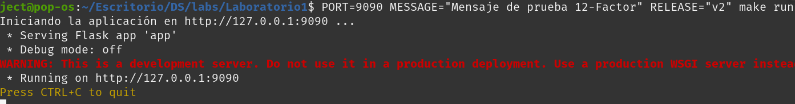

# Actividad 3: Integración de DevOps y DevSecOps con HTTP, DNS, TLS y 12-Factor App

## Parte Teorica

### 1. Introduccion a DevOps ¿Que es y que no es?
DevOps es un enfoque cultural y tecnico que integra desarrollo y operaciones para acelerar el ciclo de vida del software, desde el codigo hasta la producción mediante automatizaciones, colaboración y retroalimentación continua. A diferencia de waterfall (que es secuencial, rigido y con fases aisladas), DevOps es iterativo y flexible.

En el laboratorio, esto se evidencia en el **Makefile**, que permite a los desarrolladoes ejecutar tareas de operacioens directamente, como desplegar a app con **make run**, configurar DNS con **make hosts-setup** o gestionar servicios systemd con **make systemd-install** implementando el principio *"you build it, you run it"*

**MITOS VS REALIDADES**

* **Mito:** DevOps son solo herramientas
* **Realidad:** Es cultura, automatización, metricas y sharing (CALMS). Por ejemplo, el **Makefile** automatiza tareas, los logs en **app.py** permiten medicion y las configuraciones en **miapp.conf** son compartidas.

**Mejoras de gate de calidad en makefile:** Podria añadirse un target que verifique TLS con `make check-tls` y falle si no se cumple TLS 1.3, evitando el despliegue. Por ejemplo:

```bash
.PHONY: tls-gate
tls-gate:
    @openssl s_client -connect miapp.local:443 -servername miapp.local -brief </dev/null | grep -q "TLSv1.3" || (echo "TLS 1.3 not supported"; exit 1)
```

### 2. Marco CALMS en accion

* **Cultura:** olaboración mediante scripts compartidos. Ejemplo: **systemd/miapp.service** permite a los desarrolladores gestionar el servicio directamente, rompiendo silos
* **Automatizacion:** El **Makefile** automatiza tareas como `make prepare` (instala dependencias), `make nginx` (configuracion de proxy inverso) y `make tls-cert` (genera certificados)
* **Lean:** Targets idempotentes como `make prepare` que solo instalan dependencias si no existen, minimizando desperdicios
* **Medición:** Logs en stdout en `app.py` que podrian usars para monitoreo. Podrian agregar endpoints de salud como `\health`
* **Sharing:** Configuraciones reusables como `nginx/miapp.conf` como proxy TLS y `netplan/01-miapp.yaml` (IP estatica). Para extender se podrian añadir runbooks para incidentes como fallos de certificados y postmorten tras fallos

### 3. Vision Culturar de DevOps y paso a DevSecOps
La colaboración evita silos: el Makefile permite a desarrolladores ejecutar tareas de operaciones, como `make hosts-setup` para configurar DNS o `make systemd-install`para gestionar servicios. DevSecOps integra seguridad desde el diseño, como se ve en:

* **TLS en Nginx:** COnfigurado en `nginx/miapp.conf` con `ssl_protocols TLSv1.2 TLSv1.3` y redireccion HTTPS
* **Generacióon de certificados:** Con `make tls-cert` usando OpenSSL
* **Variables de entorno:** Usadas en `systemd/miapp.service` para configuraciones sensibles (PORT, MESSAGE)
* **Escenario de fallo de certificado:** Si un certificado expira, la mitigacion cultural implica un blameless postmortem para documentar lecciones y mejorar procesos 

### 4. Metodología 12-Factor App
En el laboratorio se demuestra el uso de 12-Factor App mediante:
1. **Configuración de entorno:** Variables de entorno como `(PORT, MESSAGE, RELEASE)` definidas en `systemd/miapp.service` y leidas en `app.py` por ejemplo `os.enviroment.get("PORT")`
2. **Port binding:** La app se vincula al puerto definido por PORT en `app.py` como ejemplo: app.run(host="127.0.0.1", port = PORT)
3. **Logs como flujos de eventos:** Logs escritos en stdout con `print` en `app.py` ejemplo: `print(f"[INFO] GET / message={MESSAGE}")`
4. **Stalessness:** La app no almacena estado, cada request es independiente (se podria mejorar) usar un archivo `.env`


## PARTE PRACTICA
### 1. Automatización reproducible con Make y Bash (Automation en CALMS)
La ejecución de las automatizaciones en makefile se muestran:


Creaccion del entorno virtual e instalación de las **dependencias necesarias** para el uso de `app.py`


El resultado indica que ya se tiene configurado el dominio local de `miapp.local` en `/etc/hosts`, la aplicación **Flask** se esta ejecutando en `http://127.0.0.1:8080`, aunque no es recomendable para produccion usar servidor de desarrollo de **Flask**

```console
ject@pop-os:~/Escritorio/DS/labs/Laboratorio1$ ss -lnt | grep :8080
LISTEN 0      128        127.0.0.1:8080       0.0.0.0:*  
```
Se evidencia que el puerto esta escuchando

#### 1.1. Agregar un target para verificar idempotencia HTTP:
Añadimos el siguiente target al **Makefile** para veriricar idempotencia HTTP y sus respuestas ante request:

```bash
.PHONY: check-idempotency
check-idempotency:
    @echo "Testing HTTP idempotency with 3 consecutive requests..."
    @for i in 1 2 3; do \
        response=$$(curl -s http://127.0.0.1:$(PORT)); \
        echo "Request $$i: $$response"; \
    done
```

Generamos 3 request consecutivas finalmente imprimimos las respuestas en consola con `echo` obteniendo:


Se evidencia respuesta correcta y esperada para las 3 request y status `"ok"`

#### 1.2. Cleap Up de servicios Nginx


#### 1.3. Explicacion cómo lean minimiza fallos
Los targets de **Makefile** son idempotentes (por ejemplo `make rpepare` solo instala si la venv no existe, y `make hosts-setup` solo añade la entrada al hosts si no esta presente). Esto evidencia redundantes y reduce errores, alineandose con los principios **Lean**


### 2. De codigo a producción 12-Factor

#### 2.1. Modificar variables sin tocar codigo
Usamos el siguiente comando:
```bash
PORT=9090 MESSAGE="Mensaje de prueba 12-Factor" RELEASE="v2" make run
```
Y obtenemos el siguiente resultado:


Inicializamos las variables de entorno antes de usar `make run` lo que implica que el **Makefile** estan preparados para leer los valores desde el entorno (usual en el 12-Factor App). Finalmente la aplicación se levanto correctamente en el puerto 9090 en lugar del 8080 por defecto.

```console
ject@pop-os:~/Escritorio/DS/labs/Laboratorio1$ ss -lnt | grep 9090
LISTEN 0      128        127.0.0.1:9090       0.0.0.0:*
```
En efecto el puerto 9090 se encuentra en modo LISTEN. De igual manera la respuesta en **JSON** con `curl` se muestra:


#### 2.2. Crear un artefacto inmutable con git archive
Debemos crear un objeto inmutable para simular release en producción, segun el factor 5 de 12-Factor

Usamos el siguiente comando:
```bash
git archive --format=zip -o release.zip HEAD
```

Su funcion es crear un archivo `release.zip` con el codigo del commit actual designado por `HEAD`

Finalmente verificamos el contenido de `release.zip`


#### 2.3. Documentacion variable -> efecto observable
| Variable | Efecto observable |
|----------|--------------------|
| PORT     | Cambia el puerto en el que la aplicación escucha. Ej: Puerto 9090 en lugar de 8080. |
| MESSAGE  | Cambia el mensaje en la respuesta JSON. Ej: "Nuevo mensaje desde 12-Factor" en lugar de "Hola". |
| RELEASE  | Cambia la versión en la respuesta JSON. Ej: "v2" en lugar de "v0". |

#### 2.4. Simular Fallo de backing (puerto equivocado) y resolver con disposability
Para simular el fallo se hara un cambio temporal al archivo app.py con:

```python
if __name__ == "__main__":
    app.run(host="127.0.0.1", port=80)  # Cambio a puerto 80
```

Al intentar ejecutar `make run` para inicializar la aplicación se obtiene:


Obtenemos un error de permisos

Finalmente modificamos temporalmente el archivo `miapp.service` para emular un error y analizarlo desde `systemctl`, obteniendo el siugiente output


El error es el siguiente:

```bash
Main PID: 29478 (code=exited, status=203/EXEC)
```
El codigo de salida **203/EXEC** en `systemd`significa que no pudo ejecutar el binario indicado en `ExecStart` y dada la inconsistencia entre el `Makefile` y `systemd`, nos muestra el error ya visto

