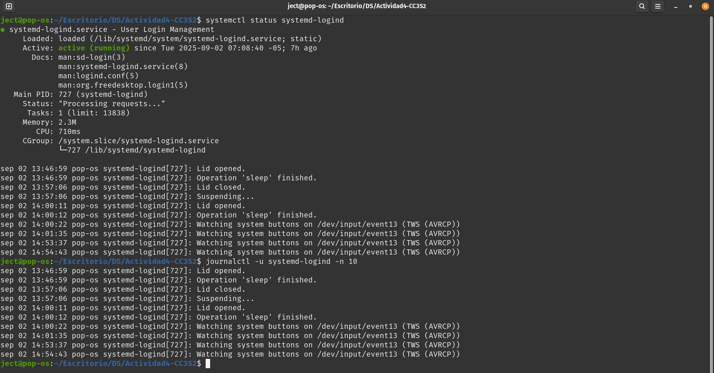
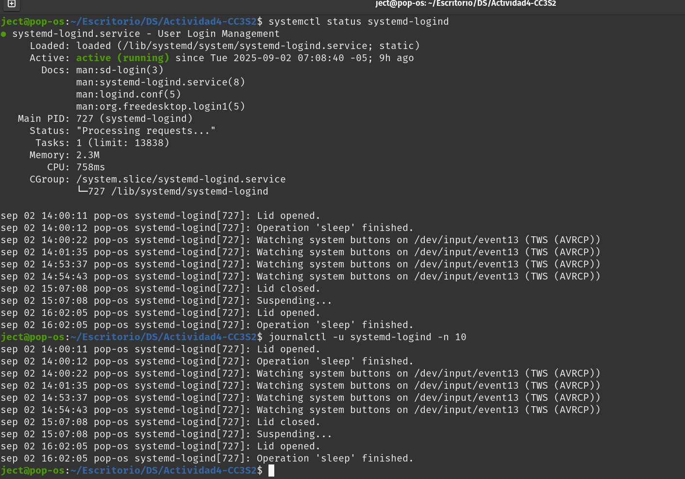

# Actividad4-CC3S2

## Comandos clave (resumen)
- uname -a -> evidencias/uname.txt
- ls -la /etc -> evidencias/etc_list.txt
- find /tmp ... -> evidencias/tmp_modificados.txt
- sudo journalctl ... -> evidencias/journal_error_today.txt
- pipeline sshd/sudo -> evidencias/pipeline_ssh_sudo.txt

## Archivos entregados
```console
ject@pop-os:~/Escritorio/DS/Actividad4-CC3S2$ ls evidencias
df.txt        hostnamectl.txt          mayus.txt              possible_secrets.txt  sesion.txt        tmp_modificados.txt
etc_list.txt  id.txt                   os-release.txt         puertosAbiertos.txt   sudo-l.txt        topProcs.txt
free.txt      journal_error_today.txt  pipeline_ssh_sudo.txt  sesion_redactada.txt  syslog_error.txt  uname.txt
```

## SECCION 1: Manejo solido de CLI
En esta sección ya se trabaja con Linux distro: Pop-os, se omitira la seccion de WSL2
1. **Navegación basica:**
En esta sección se muestra navegacion basica CLI
```console
ject@pop-os:~/Escritorio/DS/Actividad4-CC3S2$ pwd
/home/ject/Escritorio/DS/Actividad4-CC3S2
ject@pop-os:~/Escritorio/DS/Actividad4-CC3S2$ ls -l
total 8
drwxrwxr-x 2 ject ject 4096 sep  2 11:24 evidencias
-rw-rw-r-- 1 ject ject    0 sep  2 11:23 head
-rw-rw-r-- 1 ject ject  901 sep  2 11:35 README.md
ject@pop-os:~/Escritorio/DS/Actividad4-CC3S2$ ls -a
.  ..  evidencias  head  README.md
ject@pop-os:~/Escritorio/DS/Actividad4-CC3S2$ cd ~
ject@pop-os:~$ cd ..
ject@pop-os:/$ cd /tmp
ject@pop-os:/tmp$ 
```
2. **Globing**
```console
ject@pop-os:~/Escritorio/DS/Actividad4-CC3S2$ touch archivo1.txt archivo2.txt
ject@pop-os:~/Escritorio/DS/Actividad4-CC3S2$ ls *.txt
archivo1.txt  archivo2.txt
ject@pop-os:~/Escritorio/DS/Actividad4-CC3S2$ ls archivo?.txt
archivo1.txt  archivo2.txt
ject@pop-os:~/Escritorio/DS/Actividad4-CC3S2$ ls archivo[12].txt
archivo1.txt  archivo2.txt
ject@pop-os:~/Escritorio/DS/Actividad4-CC3S2$  
```
3. **Pipes (Tuberias)**
```consola
ject@pop-os:~/Escritorio/DS/Actividad4-CC3S2$ ls -A | wc -l
5
ject@pop-os:~/Escritorio/DS/Actividad4-CC3S2$ 
```
Para este ejemplo `ls -A`lista sin contar . ni .. y `wc -l` cuenta las lineas o numero de entradas\

4. **Redirecciones**
```console
ject@pop-os:~/Escritorio/DS/Actividad4-CC3S2$ ls > lista.txt
ject@pop-os:~/Escritorio/DS/Actividad4-CC3S2$ cat lista.txt
archivo1.txt
archivo2.txt
evidencias
head
lista.txt
README.md
ject@pop-os:~/Escritorio/DS/Actividad4-CC3S2$ printf "Hola\n" >> lista.txt
ject@pop-os:~/Escritorio/DS/Actividad4-CC3S2$ wc -l < lista.txt
7
ject@pop-os:~/Escritorio/DS/Actividad4-CC3S2$ ls noexiste 2> errores.txt
```
En esta seccion se ejemplifican distintas maneras de redireccionamiento en archivos de manera local.

5. **xargs**
Un problema muy común con los pipeline son nombres de archivos con espacios o saltos de linea, este tipo de archivos suelen romper pipelines simples
```console
-maxdepth 1 -type f -name 'archivo*.txt' -print0 \
  | xargs -0 -r -I {} echo rm -- "{}"
```
Para esta practica `find` busca archivos terminados en `archivo*.txt`pero solo ficheros no directorios, `-print0`separa los resultados encontrados con caracter null `xargs -0` lee los argumentos separados por null (maneja espacios y newlines) `-r` evita ejecutar si no hay entrada. La razon de su uso es que evitan borrados que rompen por espacios o nombres extraños

## **SECCION 2: Administración Basica:**
### **1. Usuarios/Grupos/Permisos**
```console
ject@pop-os:~/Escritorio/DS/Actividad4-CC3S2$ sudo adduser nuevouser
Añadiendo el usuario `nuevouser' ...
Añadiendo el nuevo grupo `nuevouser' (1001) ...
Añadiendo el nuevo usuario `nuevouser' (1001) con grupo `nuevouser' ...
Creando el directorio personal `/home/nuevouser' ...
Copiando los ficheros desde `/etc/skel' ...
ject@pop-os:~/Escritorio/DS/Actividad4-CC3S2$ sudo addgroup nuevogrupo; sudo usermod -aG nuevogrupo nuevouser
addgroup: El grupo `nuevogrupo' ya existe.
ject@pop-os:~/Escritorio/DS/Actividad4-CC3S2$ touch archivo; chmod 644 archivo
ject@pop-os:~/Escritorio/DS/Actividad4-CC3S2$ chown nuevouser:nuevogrupo archivo
chown: cambiando el propietario de 'archivo': Operación no permitida
ject@pop-os:~/Escritorio/DS/Actividad4-CC3S2$ sudo chown nuevouser:nuevogrupo archivo
ject@pop-os:~/Escritorio/DS/Actividad4-CC3S2$ 
```
### **2. Procesos y señales**
El output en consola es demasiado extenso por lo que se simulara un proceso inofensivo y que termina limpiamente
```console
ject@pop-os:~/Escritorio/DS/Actividad4-CC3S2$ sleep 100 &
[2] 15273
ject@pop-os:~/Escritorio/DS/Actividad4-CC3S2$ jobs -l
[1]- 15249 Ejecutando              sleep 100 &
[2]+ 15273 Ejecutando              sleep 100 &
ject@pop-os:~/Escritorio/DS/Actividad4-CC3S2$ kill -SIGTERM 15249 15273
ject@pop-os:~/Escritorio/DS/Actividad4-CC3S2$ jobs -l
[1]- 15249 Terminado               sleep 100
[2]+ 15273 Terminado               sleep 100
```
creamos un proceso simple en background con `sleep 100` con `jobs -l` identificamos el PID del proceso recien creado finalmente con `kill -SIGTERM 15249 15273` matamos el proceso
### **3. systemd**
Se meustra evidencia debido a lo extenso del output


## EJERCICOS DE REFORZAMIENTO
### 1. Creación de usuario y cambio de permisos
```console
ject@pop-os:~/Escritorio/DS/Actividad4-CC3S2$ sudo adduser devsec; sudo addgroup ops; sudo usermod -aG ops devsec; touch secreto.txt; sudo chown devsec:ops secreto.txt; sudo chmod 640 secreto.txt
[sudo] contraseña para ject: 
Añadiendo el usuario `devsec' ...
Añadiendo el nuevo grupo `devsec' (1003) ...
Añadiendo el nuevo usuario `devsec' (1002) con grupo `devsec' ...
Creando el directorio personal `/home/devsec' ...
Copiando los ficheros desde `/etc/skel' ...
Nueva contraseña: 
Vuelva a escribir la nueva contraseña: 
passwd: contraseña actualizada correctamente
Cambiando la información de usuario para devsec
Introduzca el nuevo valor, o presione INTRO para el predeterminado
	Nombre completo []: ject02
	Número de habitación []: 0
	Teléfono del trabajo []: 999
	Teléfono de casa []: 999
	Otro []: 0
¿Es correcta la información? [S/n] s
Añadiendo el grupo `ops' (GID 1004) ...
Hecho.
ject@pop-os:~/Escritorio/DS/Actividad4-CC3S2$ 
```
### 2. Listamiento de procesos 
```console
ject@pop-os:~/Escritorio/DS/Actividad4-CC3S2$ ps aux | grep bash
ject        2036  0.0  0.0  19776  3604 ?        SN   07:09   0:00 /bin/bash /usr/bin/brave-browser-stable
ject        7157  0.0  0.0  24480  3868 pts/1    SNs+ 10:21   0:00 /usr/bin/bash --init-file /usr/share/code/resources/app/out/vs/workbench/contrib/terminal/common/scripts/shellIntegration-bash.sh
ject        9997  0.0  0.0  25824 10184 pts/0    SNs  11:26   0:00 bash
ject       10308  0.0  0.0  24484  9052 pts/2    Ss+  11:27   0:00 /usr/bin/bash --init-file /usr/share/code/resources/app/out/vs/workbench/contrib/terminal/common/scripts/shellIntegration-bash.sh
ject       16763  0.0  0.0  19036  2620 pts/0    SN+  16:07   0:00 grep --color=auto bash
ject@pop-os:~/Escritorio/DS/Actividad4-CC3S2$ 
```
### 3. Verificación del estado del servicio


### 4. Iniciar proceso background y matarlo con kill
```console
ject@pop-os:~/Escritorio/DS/Actividad4-CC3S2$ sleep 200 &
[1] 16985
ject@pop-os:~/Escritorio/DS/Actividad4-CC3S2$ PID2=$!
ject@pop-os:~/Escritorio/DS/Actividad4-CC3S2$ ps -p $PID2 -o pid,ppid,cmd,etimes > ~/Actividad4-CC3S2/evidencias/ps_sleep2.txt
ject@pop-os:~/Escritorio/DS/Actividad4-CC3S2$ kill -SIGTERM $PID2
ject@pop-os:~/Escritorio/DS/Actividad4-CC3S2$ ps -p $PID2 > /dev/null && echo "PID2 sigue" || echo "PID2 terminado" > ~/Actividad4-CC3S2/evidencias/kill_sleep2_result.txt
[1]+  Terminado               sleep 200
```
La creación de un proceso vago en background se realiza con `sleep 200 &` se lista usando `ps`finalmente con `kill -SIGTERM $PID2` se mata el proceso dando como resultado `[1]+  Terminado               sleep 200`

## SECCIÓN 3: Utilidades de texto de Unix
En esta sección se analizara y estudiara los comandos basicos para mitigacion de riesgos en **`DevSecOps`**
### 1. Uso de grep para buscar potrones de archivo
```console
ject@pop-os:~/Escritorio/DS/Actividad4-CC3S2$ grep -n '^root:' /etc/passwd
1:root:x:0:0:root:/root:/usr/bin/zsh
ject@pop-os:~/Escritorio/DS/Actividad4-CC3S2$ 
```
Se realiza una busqueda generica de ocurrencias de `root` en `etc/passswd` con el objetivo de bsucar rapidamente entradas relacionadas con el usuario `root`, `grep`solo da información ya que sirve solo como lectura y no modificacion, adicionalmente se debe manejar bien para evitar coincidencias falsas, como por ejemplo `xrooty`
### 2. Uso de `sed` para sustitucion de datos
```console
ject@pop-os:~/Escritorio/DS/Actividad4-CC3S2$ printf "linea1: dato1\nlinea2: dato2\n" > datos.txt
ject@pop-os:~/Escritorio/DS/Actividad4-CC3S2$ sed 's/dato1/secreto/' datos.txt > nuevo.txt
ject@pop-os:~/Escritorio/DS/Actividad4-CC3S2$ 
```
sed lee los datos del archivo de prueba `datos.txt` y reemplaza la primera aparicion de dato1 por secreto en cada linea y finalmente escribe el resultado en el archivo `nuevo.txt`, muy util cuando se quiere editar streams sin usar el editor, sin embargo, usar `sed -i`hace cambios in-place que pueden ser irreversibles

### 3. Uso de `awk/cut`
```console
awk -F: '{print $1}' /etc/passwd | sort | uniq
cut -d: -f1 /etc/passwd | sort | uniq
```
Separa por `:` y toma la primera columna que es el nombre de usuario, ordena y quita duplicados, `awk`es mas potente que transformaciones, mientras que `cut`es mas simple y rapido para campos fijos.

### 4. Uso de `sort/uniq`
```console
ject@pop-os:~/Escritorio/DS/Actividad4-CC3S2$ sudo cat *.txt | sort | uniq
archivo1.txt
archivo2.txt
evidencias
head
Hola
linea1: dato1
linea1: secreto
linea2: dato2
lista.txt
```
Un uso basico es usando cat para obtener todos los archivos con extension .txt usando `*.txt`finalmente se para por un pipe siendo que `sort` obtiene los archivos concatenados y los ordena mientras que `uniq`no cuenta los archivos repetidos, sin embargo su uso necesita una agrupacion apriori de forma correcta.

### 5. Uso de `tr/tee`para transformación de caracteres
```console
ject@pop-os:~/Escritorio/DS/Actividad4-CC3S2$ printf "hola\n" | tr '[:lower:]' '[:upper:]' | tee mayus.txt
HOLA
ject@pop-os:~/Escritorio/DS/Actividad4-CC3S2$
```
`tr` transforma las minusculas en mayusculas mientras que `tee`muestra en pantalla el resultado mientras que escribe en el archivo mayus.txt, muy util para ver la transformacion realziada ademas que se peude realizar una mezcla con expresiones regulares

### 6. Uso de `find` para busqueda de ficheros
```console
ject@pop-os:~/Escritorio/DS/Actividad4-CC3S2$ find /tmp -maxdepth 1 -mtime -5 -type f -printf '%TY-%Tm-%Td %TT %p\n' | sort
2025-09-02 07:08:53.1095034010 /tmp/gdm3-config-err-ilv3o5
2025-09-02 10:21:48.2670345180 /tmp/exthost-7d3477.cpuprofile
2025-09-02 17:07:22.6815858890 /tmp/.org.chromium.Chromium.WpcD3M
```
`find` busca en el directorio **\temp** pero no entra a subcarpetas, esto es intensional con `-maxdepth 1` y tambien se trunca las fechas de modificacion con `ntime -5` para obtener los archivos modificados en los ultimos 5 dias

## EJERCICIOS DE REFORZAMIENTO
```bash
#!/bin/bash
grep root /etc/passwd
sed 's/dato1/secreto/' datos.txt > nuevo.txt
awk -F: '{print $1}' /etc/passwd | sort | uniq
printf "hola\n" | tr 'a-z' 'A-Z' | tee mayus.txt
find /tmp -mtime -5 -type f
ls /etc | grep conf | sort | tee lista_conf.txt | wc -l
grep -Ei 'error|fail' evidencias/sesion.txt | tee evidencias/hallazgos.txt
```
Para los ejercicios se intento automatizar procesos vistos en esta seccion, se procedera con la explicacion rapida:
* **grep root /etc/passwd** Busca las lineas que contienen la palabra `root` en el archivo mencionado que es la lista de usuarios del sistema actual
* **sed 's/dato1/secreto/' datos.txt > nuevo.txt** Lee `datos.txt` y reemplaza la primera ocurrencia de `dato1` por `secreto` en cada linea y finalmente guarda el resultado en `nuevo.txt`
* **awk -F: '{print $1}' /etc/passwd | sort | uniq** Extrae la primera columna de `/etc/passwd`(nombres de usuarios), ordena alfabeticamente y elimina duplicados
* **printf "hola\n" | tr 'a-z' 'A-Z' | tee mayus.txt** Convierte `hola`en mayuscula y lo muestra en consola mientras guarda en `mayus.txt`
* **ls /etc | grep conf | sort | tee lista_conf.txt | wc -l** Lista */etc*, filtra nombres que contienen `conf`, los ordena, guarda la lista en `lista_conf.txt` y cuenta cuantos hay par mostrarlo en consola
* **grep -Ei 'error|fail' evidencias/sesion.txt | tee evidencias/hallazgos.txt** Busca lineas que contengan `error` o `fail` insensible a mayusculas, en evidencias.txt y guarda las salidas en `hallazgos.txt` y lo muestra en consola